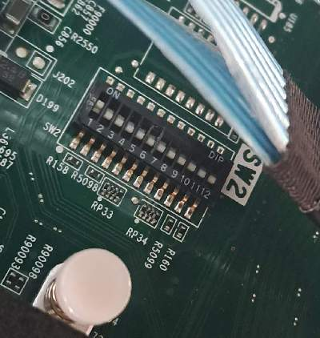
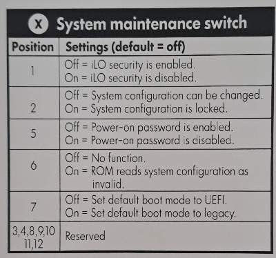
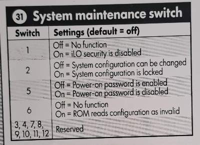

# A craft project: Building a small GPU server with a HP Proliant and passively cooled NVIDIA Tesla cards like M4, P4 or T4
##  Flashing iLO ROM

### Legal (from Kendall https://github.com/kendallgoto/ilo4_unlock)
There is risk for potential damage to your system when utilizing this code. If an error occurs during flashing, or you end up flashing corrupted firmware, the iLO will not be able to recover itself. The iLO's flash chip cannot be programmed on-board, and must be fully desoldered and reprogrammed to recover the functionality. Additionally, utilizing the included new features may cause your server to overheat or otherwise suffer damage. Do not proceed with installing this firmware if you don't know what you're doing. You have been warned. There is no warranty for this code nor will I be responsible for any damage you cause.

I have personally only tested this firmware on my DL360 Gen9.

### Getting files
Needed files: flash_ilo4, ilo4_250.bin and CP027911.xml 
I got these files from https://github.com/That-Guy-Jack/HP-ILO-Fan-Control and https://www.reddit.com/r/homelab/comments/hix44v/silence_of_the_fans_pt_2_hp_ilo_4_273_now_with/ or  https://www.reddit.com/r/homelab/comments/sx3ldo/hp_ilo4_v277_unlocked_access_to_fan_controls/

It does not matter which iLO file you download (e.g. ilo4_277.bin.patched oder ilo4_273.bin.fancommands), you have to rename it to ilo4_250.bin because the file CP027911.xml expects a file with the name ilo4_250.bin in the same directory. 2.77 is the latest version that can be extended by these fan functions. You can seek for a patched file (see reddit post) or patch it yourself as described at https://github.com/kendallgoto/ilo4_unlock. 

### Prepareing iLO
- Set the IPv4 address, e.g. 192.168.1.3
- Add a new user 'fan' with a new password that has the rigth to hardware (you can use an existing user as well)

## Write the new iLO to ROM:
There are different ways to flash the ILO. This is how I did it - all work was done in the server room with keyboard and a monitor connected to the server directly:

1. Install a bare metal Linux (e.g. Ubuntu 24 LTS) and boot the server
2. Create a directory 'fash' in root's home
3. Copy / upload the files flash_ilo4, ilo4_250.bin and CP027911.xml into the directory flash
4. Shutdown the server
4. Unplug the server from power
5. Open server
6. **Switch dip S1 to 1  (maintenance mode, iLO security is disabled)**
7. Plug the server to power and boot Linux 
8. Maybe you need to stop already installed HP services: /etc/init.d/hp-ams stop; /etc/init.d/hp-health stop; /etc/init.d/hp-snmp-agents stop
9. **modprobe -r hpilo**
10. Change to flash directory in root's home and flash the ROM: cd flash; **./flash_ilo4 --direct**
11. **WAIT (!) at least 3 minutes after flashing** is done. The fans will spin down and later spin up!
12. Shutdown the server
13. **Unplug from power**
14. **Switch dip S1 back to 0** (iLO 2 security is enabled)
15. Close server
16. Plug the server to power and boot Linux again
17. Done


### Images
 
**DIP switch on mainboard. See image on the inner cover.**

 
**Gen9 switch settings**

 
**Gen8 switch settings**


### Testing:
Now you can connect to iLO by ssh if you already configured the network settings and iLO interface is accessible by network.

**Due to a bug only the first connection and first command to iLO are shown. ALL commands are executed and take effect but the following commands have an empty status line.**

My first command on my HP Proliant DL360 Gen9 was as iLO user 'fan' (you need to add this user in iLO configuration):**fan info**

```
root:~# ssh -o KexAlgorithms=+diffie-hellman-group14-sha1 -oHostKeyAlgorithms=+ssh-dss fan@192.168.1.3
fan@192.168.1.3's password:
User:fan logged-in to ILOM89.

iLO Standard 2.73 at  Feb 11 2020
Server Name:
Server Power: On

</>hpiLO-> fan info

TEMPERATURES
No.        Name          Raw    Off Hyst   Adj   Caut   Crit    Opts    Stat   OK  ocsd X, Y (access method)
 0  01-Inlet Ambient   19.00   0.00   3  19.00  42.00  46.00   0x0270  0x0001  Y   00  15, 0 (I2C: Flags:0x8000 Bus:0x05 Addr:0x98 Reg:0x01 Reg2:0x00 Mask:0x00 Shift:0x00)
 1  02-CPU 1          -58.92   0.00   2 -58.89   0.25   0.00   0x0000  0x0001  Y   00  11, 5 (PECI DTS [0] Offset (FP100))
 2  03-CPU 2          -59.00   0.00   2 -59.01   0.25   0.00   0x0000  0x0001  Y   00   4, 5 (PECI DTS [1] Offset (FP100))
 3  04-P1 DIMM 1-6      0.00   0.00   0   0.00  89.00   0.00   0x0000  0x0000  Y   00   9, 5 (DIMM Grp [0] Temp)
 4  05-P1 DIMM 7-12    23.00   0.00   0  23.00  89.00   0.00   0x0000  0x0001  Y   00  14, 5 (DIMM Grp [1] Temp)
 5  06-P2 DIMM 1-6      0.00   0.00   0   0.00  89.00   0.00   0x0000  0x0000  Y   00   1, 5 (DIMM Grp [2] Temp)
 6  07-P2 DIMM 7-12    25.00   0.00   0  25.00  89.00   0.00   0x0000  0x0001  Y   00   6, 5 (DIMM Grp [3] Temp)
 7  08-HD Max         -36.00  50.00   2  14.00  60.00   0.00   0x0000  0x0001  Y   00  10, 0 (HDD Grp [2308] Raw)
 8  09-Exp Bay Drive    0.00   0.00   2   0.00  75.00   0.00   0x0000  0x0000  Y   00  12, 0 (Constant: Value: 0)
 9  10-Chipset         36.00   0.00   0  36.00 105.00   0.00   0x0000  0x0001  Y   00  13,10 (PCH: Flags:0x0000 Bus:0x01 Addr:0x66 Reg:0x44 Mask:0x7F)
10  11-PS 1 Inlet      24.00   0.00   5  24.00   0.00   0.00   0x0000  0x0001  Y   00   1,10 (P/S [1] TempC)
11  12-PS 2 Inlet      27.00   0.00   5  27.00   0.00   0.00   0x0000  0x0001  Y   00   4,10 (P/S [2] TempC)
12  13-VR P1           30.00   0.00   0  30.00 115.00 120.00   0x0010  0x0001  Y   00  10, 1 (SpecI2C: Flags:0x0004 Bus:0x00 Addr:0x50 Slv:0x8D Cmd:0x00 WrReg:0x00 GPUs:0)
13  14-VR P2           32.00   0.00   0  32.00 115.00 120.00   0x0010  0x0001  Y   00   4, 1 (SpecI2C: Flags:0x0004 Bus:0x00 Addr:0x54 Slv:0x8D Cmd:0x00 WrReg:0x00 GPUs:0)
14  15-VR P1 Mem       28.00   0.00   0  28.00 115.00 120.00   0x0010  0x0001  Y   00   9, 1 (SpecI2C: Flags:0x0004 Bus:0x00 Addr:0x64 Slv:0x8D Cmd:0x00 WrReg:0x00 GPUs:0)
15  16-VR P1 Mem       26.00   0.00   0  26.00 115.00 120.00   0x0010  0x0001  Y   00  13, 1 (SpecI2C: Flags:0x0004 Bus:0x00 Addr:0x60 Slv:0x8D Cmd:0x00 WrReg:0x00 GPUs:0)
16  17-VR P2 Mem       30.00   0.00   0  30.00 115.00 120.00   0x0010  0x0001  Y   00   2, 1 (SpecI2C: Flags:0x0004 Bus:0x00 Addr:0x6C Slv:0x8D Cmd:0x00 WrReg:0x00 GPUs:0)
17  18-VR P2 Mem       29.00   0.00   0  29.00 115.00 120.00   0x0010  0x0001  Y   00   6, 1 (SpecI2C: Flags:0x0004 Bus:0x00 Addr:0x68 Slv:0x8D Cmd:0x00 WrReg:0x00 GPUs:0)
18  19-PS 1 Internal   51.00  -25.00   5  26.00   0.00   0.00   0x0000  0x0001  Y   00   1,13 (P/S [1] InternalTemp%)
19  20-PS 2 Internal   52.00  -25.00   5  27.00   0.00   0.00   0x0000  0x0001  Y   00   4,13 (P/S [2] InternalTemp%)
20  21-PCI 1            0.00  90.00   0  90.00 100.00   0.00   0x0200  0x0008  N   01  13,13 (OCSD Slot/Mezz #1 SensorType 1 [01/01/00/00/00])
21  22-PCI 2            0.00  90.00   0  90.00 100.00   0.00   0x0200  0x0008  N   02  13,13 (OCSD Slot/Mezz #2 SensorType 1 [01/02/00/00/00])
22  23-PCI 3            0.00  90.00   0  90.00 100.00   0.00   0x0200  0x0008  N   03   5,12 (OCSD Slot/Mezz #3 SensorType 1 [01/03/00/00/00])
23  24-HD Controller  -55.00  90.00   0  35.00 100.00   0.00   0x0200  0x0001  Y   04   8, 8 (OCSD OnBoard/ALOM/BLOM SensorType 1 Addr 0a 01 00 [01/00/0a/01/00])
24  25-LOM Card       -49.00  90.00   0  41.00 100.00   0.00   0x0200  0x0001  Y   05  14,13 (OCSD OnBoard/ALOM/BLOM SensorType 1 Addr 05 31 00 [01/00/05/31/00])
25  26-LOM              0.00  90.00   0  90.00 100.00   0.00   0x0200  0x0008  N   06   7,13 (OCSD OnBoard/ALOM/BLOM SensorType 1 Addr 05 01 00 [01/00/05/01/00])
26  27-Front Ambient   23.00   0.00   3  23.00  65.00   0.00   0x0000  0x0001  Y   00   9, 0 (I2C: Flags:0x8000 Bus:0x05 Addr:0x98 Reg:0x00 Reg2:0x00 Mask:0x00 Shift:0x00)
27  28-P/S 2 Zone      28.00   0.00   0  28.00  75.00   0.00   0x0000  0x0001  Y   00   3, 7 (I2C: Flags:0x8000 Bus:0x05 Addr:0x38 Reg:0x2A Reg2:0x00 Mask:0x00 Shift:0x00)
28  29-Battery Zone    28.00   0.00   0  28.00  75.00  80.00   0x0010  0x0001  Y   00   7,10 (I2C: Flags:0x8000 Bus:0x05 Addr:0x38 Reg:0x00 Reg2:0x00 Mask:0x00 Shift:0x00)
29  30-iLO Zone        35.00   0.00   0  35.00  90.00  95.00   0x0010  0x0001  Y   00   9,14 (I2C: Flags:0x8000 Bus:0x05 Addr:0x38 Reg:0x23 Reg2:0x00 Mask:0x00 Shift:0x00)
30  31-PCI 1 Zone      29.00   0.00   0  29.00  70.00  75.00   0x0210  0x0001  Y   01  13,13 (I2C: Flags:0x8000 Bus:0x05 Addr:0xB8 Reg:0x00 Reg2:0x00 Mask:0x00 Shift:0x00)
31  32-PCI 2 Zone      28.00   0.00   0  28.00  70.00  75.00   0x0210  0x0001  Y   02  13,13 (I2C: Flags:0x8000 Bus:0x05 Addr:0xB8 Reg:0x01 Reg2:0x00 Mask:0x00 Shift:0x00)
32  33-PCI 3 Zone      29.00   0.00   0  29.00  70.00  75.00   0x0210  0x0001  Y   03   5,12 (I2C: Flags:0x8000 Bus:0x05 Addr:0x78 Reg:0x00 Reg2:0x00 Mask:0x00 Shift:0x00)
33  34-HD Cntlr Zone   32.00   0.00   0  32.00  70.00  75.00   0x0210  0x0001  Y   04  11, 7 (I2C: Flags:0x8000 Bus:0x05 Addr:0xD8 Reg:0x00 Reg2:0x00 Mask:0x00 Shift:0x00)
34  35-I/O Zone        27.00   0.00   0  27.00  75.00  80.00   0x0010  0x0001  Y   05  14,11 (I2C: Flags:0x8000 Bus:0x05 Addr:0x38 Reg:0x01 Reg2:0x00 Mask:0x00 Shift:0x00)
35  36-Storage Batt    24.00   0.00   0  24.00  60.00   0.00   0x0200  0x0001  Y   00   8, 0 (NOISY: Flags:0xB001 Bus:0x14 Addr:0xC0 Reg:0x1C Mask:0x40)
36  37-Fuse            27.56   0.00   0  27.56 100.00   0.00   0x0200  0x0001  Y   00   1, 8 (I2C: Flags:0xC019 Bus:0x07 Addr:0x80 Reg:0x8D Reg2:0x00 Mask:0x00 Shift:0x00)
37  55,OCSD Virtual     0.00  50.00   0  50.00   0.00   0.00   0x0000  0x0008  N   0a   0, 0 (OCSD Slot/Mezz #15 SensorType 1 [01/0f/00/00/00])
38  56,iLO Zone        35.00   0.00   0  35.00   0.00   0.00   0x0000  0x0001  Y   0a   0, 0 (APMLData: Flags:0xC000 Size:0x02 RID:0x001F Offset:0x0082 Mask:0x00)
39  57,I/O Zone        27.00   0.00   0  27.00   0.00   0.00   0x0000  0x0001  Y   0a   0, 0 (APMLData: Flags:0xC000 Size:0x02 RID:0x0024 Offset:0x0082 Mask:0x00)
40  58,Derived         29.00   0.00   0  29.00   0.00   0.00   0x0000  0x0001  Y   00   0, 0 (APMLData: Flags:0xC000 Size:0x02 RID:0x0020 Offset:0x0082 Mask:0x00)
41  59,Derived         28.00   0.00   0  28.00   0.00   0.00   0x0000  0x0001  Y   00   0, 0 (APMLData: Flags:0xC000 Size:0x02 RID:0x0021 Offset:0x0082 Mask:0x00)
42  60,Derived         28.00   0.00   0  28.00   0.00   0.00   0x0000  0x0001  Y   00   0, 0 (APMLData: Flags:0xC000 Size:0x02 RID:0x0021 Offset:0x0082 Mask:0x00)
43  61,Derived         29.00   0.00   0  29.00   0.00   0.00   0x0000  0x0001  Y   00   0, 0 (APMLData: Flags:0xC000 Size:0x02 RID:0x0022 Offset:0x0082 Mask:0x00)
44  62,Derived         29.00   0.00   0  29.00   0.00   0.00   0x0000  0x0001  Y   00   0, 0 (APMLData: Flags:0xC000 Size:0x02 RID:0x0022 Offset:0x0082 Mask:0x00)
45  63,CPU-1          -48.09   0.00   0 -48.09   0.00   0.00   0x0000  0x0001  Y   00   0, 0 (PECI DTS [0] DTS 2.0)
46  64,CPU-2          -49.09   0.00   0 -49.09   0.00   0.00   0x0000  0x0001  Y   00   0, 0 (PECI DTS [1] DTS 2.0)

OCSD Data Collection Status: "Polling... (Header is Good; SMBIOS 229 record is Good)"

OCSD information: (1 updates) Overall association status: 0x00000000
No. OCSD?  Assoc  Status_of_OCSD_sensor
20    Y           (3)Option card does not support OCSD (Prev: 9) (Source: (0) NONE)
21    Y           (2)No Option card (Prev: 9) (Source: (0) NONE)
22    Y           (3)Option card does not support OCSD (Prev: 9) (Source: (0) NONE)
23    Y           (0)Option card OK (Prev: 5) (Status: (6) OCSD OK, PLDM Unknown) (Source: (1) OCSD)
24    Y           (0)Option card OK (Prev: 5) (Status: (6) OCSD OK, PLDM Unknown) (Source: (1) OCSD)
25    Y           (5)Option card failed (Prev: 9) (Status: (18) OCSD Failed, PLDM Unknown) (Source: (0) NONE)
30    N     20    N/A
31    N     21    N/A
32    N     22    N/A
33    N     23    N/A
34    N     24    N/A
37    Y           (2)No Option card (Prev: 9) (Source: (0) NONE)
38    N     37    N/A
39    N     37    N/A
End of OCSD information.

SENSOR GROUPS

ALGORITHMS
Segmented Algorithms
00  L (10.00C-25.00C)*|L (25.00C-30.00C) |L (30.00C-35.00C) |L (35.00C-40.00C) |L (40.00C-45.00C) |L (45.00C-55.00C) |   PWM 30 <--> 50:  drive: 42 PWM
26  L (10.00C-25.00C)*|L (25.00C-30.00C) |L (30.00C-35.00C) |L (35.00C-40.00C) |L (40.00C-45.00C) |L (45.00C-55.00C) |   PWM 30 <--> 50:  drive: 47 PWM
30  L (25.00C-35.00C)*|L (35.00C-40.00C) |L (40.00C-45.00C) |L (45.00C-50.00C) |L (50.00C-60.00C) |L (60.00C-65.00C) |   PWM 30 <--> 45:  drive: 36 PWM
31  L (30.00C-40.00C) |L (40.00C-45.00C) |L (45.00C-50.00C) |L (50.00C-55.00C) |L (55.00C-60.00C) |L (60.00C-65.00C) |   PWM 30 <--> 90:  drive: 30 PWM
32  L (30.00C-40.00C) |L (40.00C-45.00C) |L (45.00C-50.00C) |L (50.00C-55.00C) |L (55.00C-60.00C) |L (60.00C-65.00C) |   PWM 30 <--> 85:  drive: 30 PWM
38  L (30.00C-41.00C)*|L (41.00C-48.00C) |L (48.00C-53.00C) |L (53.00C-59.00C) |   PWM 30 <--> 75:  drive: 50 PWM
39  L (25.00C-31.00C)*|L (31.00C-39.00C) |L (39.00C-45.00C) |L (45.00C-52.00C) |   PWM 30 <--> 75:  drive: 45 PWM

PID Algorithms
No. Pgain  Igain  Dgain SetPoint    Imin   Imax  low_lim  high_lim  prev_drive output
01  10.00   0.50   8.00   -6.00     0.00    0.00   30.00    255.00     30.00    30 PWM
02  10.00   0.50   8.00   -6.00     0.00    0.00   30.00    255.00     30.00    30 PWM
03   4.00   0.50   2.00   76.00     0.00    0.00   16.00    255.00     16.00    16 PWM
04   4.00   0.50   2.00   76.00     0.00    0.00   16.00    255.00     16.00    16 PWM
05   4.00   0.50   2.00   76.00     0.00    0.00   16.00    255.00     16.00    16 PWM
06   4.00   0.50   2.00   76.00     0.00    0.00   16.00    255.00     16.00    16 PWM
07   8.00   0.05   0.25   46.00     0.00    0.00   16.00    255.00     16.00    16 PWM
08   8.00   0.10   0.50   60.00     0.00    0.00   50.00    255.00     50.00    50 PWM
09   5.00   0.15   1.00   85.00     0.00    0.00   16.00    255.00     16.00    16 PWM
10   5.00   0.50   1.00   57.00     0.00    0.00   16.00    255.00     16.00    16 PWM
11   5.00   0.50   1.00   57.00     0.00    0.00   16.00    255.00     16.00    16 PWM
12   4.00   0.50   2.00   90.00     0.00    0.00   16.00    255.00     16.00    16 PWM
13   4.00   0.50   2.00   90.00     0.00    0.00   16.00    255.00     16.00    16 PWM
14   4.00   0.50   2.00   90.00     0.00    0.00   16.00    255.00     16.00    16 PWM
15   4.00   0.50   2.00   90.00     0.00    0.00   16.00    255.00     16.00    16 PWM
16   4.00   0.50   2.00   90.00     0.00    0.00   16.00    255.00     16.00    16 PWM
17   4.00   0.50   2.00   90.00     0.00    0.00   16.00    255.00     16.00    16 PWM
18   5.00   0.50   1.00   75.00     0.00    0.00   16.00    255.00     16.00    16 PWM
19   5.00   0.50   1.00   75.00     0.00    0.00   16.00    255.00     16.00    16 PWM
20   8.00   0.30   2.00   85.00     0.00    0.00   30.00    255.00      0.00     0 PWM
21   8.00   0.30   2.00   85.00     0.00    0.00   30.00    255.00      0.00     0 PWM
22   8.00   0.30   2.00   85.00     0.00    0.00   30.00    255.00      0.00     0 PWM
23   8.00   0.30   1.50   85.00     0.00    0.00   16.00    255.00     16.00    16 PWM
24   8.00   0.30   1.50   85.00     0.00    0.00   16.00    255.00     16.00    16 PWM
25   3.00   0.15   1.00   85.00     0.00    0.00   16.00    255.00      0.00     0 PWM
27   5.00   0.15   1.00   60.00     0.00    0.00   16.00    255.00     16.00    16 PWM
28   5.00   0.15   1.00   60.00     0.00    0.00   16.00    255.00     16.00    16 PWM
29   5.00   0.15   1.00   65.00     0.00    0.00   16.00    255.00     16.00    16 PWM
33   3.00   0.15   1.00   60.00     0.00    0.00   70.00    255.00     70.00    70 PWM
34   5.00   0.15   1.00   50.00     0.00    0.00   70.00    255.00     70.00    70 PWM
35   5.00   0.15   1.00   47.00     0.00    0.00   16.00    255.00     16.00    16 PWM
36   5.00   0.15   1.00   90.00     0.00    0.00   16.00    255.00     16.00    16 PWM
37   2.00   0.15   1.00   50.00     0.00    0.00   16.00     16.00      0.00     0 PWM
45  10.00   0.50   8.00    0.00     0.00    0.00   30.00    255.00     30.00    30 PWM
46  10.00   0.50  12.00    0.00     0.00    0.00   30.00    255.00     30.00    30 PWM

GROUPINGS
0: FASTEST Output:  50  [01 02 03 04 05 06 07 08*09 10 11 12 13 14 15 16 17 18 19 20 21 22 23 24 25 27 28 29 30 32 35 36 37 40 41 42 43 44 45 46 ]
1: FASTEST Output:  40  [01 02 03 04 05 06 07 08*09 10 11 12 13 14 15 16 17 18 19 20 21 22 23 24 25 27 28 29 30 32 35 36 37 40 41 42 43 44 45 46 ]
2: FASTEST Output:  50  [01 02 03 04 05 06 07 08*09 10 11 12 13 14 15 16 17 18 19 20 21 22 23 24 25 27 28 29 30 32 35 36 37 40 41 42 43 44 45 46 ]
3: FASTEST Output:  50  [01 02 03 04 05 06 07 08*09 10 11 12 13 14 15 16 17 18 19 20 21 22 23 24 25 27 28 29 30 32 35 36 37 40 41 42 43 44 45 46 ]
4: FASTEST Output:  50  [01 02 03 04 05 06 07 08*09 10 11 12 13 14 15 16 17 18 19 20 21 22 23 24 25 27 28 29 30 32 35 36 37 40 41 42 43 44 45 46 ]
5: FASTEST Output:  50  [01 02 03 04 05 06 07 08*09 10 11 12 13 14 15 16 17 18 19 20 21 22 23 24 25 27 28 29 30 32 35 36 37 40 41 42 43 44 45 46 ]
6: FASTEST Output:  50  [01 02 03 04 05 06 07 08*09 10 11 12 13 14 15 16 17 18 19 20 21 22 23 24 25 27 28 29 30 32 35 36 37 40 41 42 43 44 45 ]

PWMs:
No.  PWM   Min   Max  Hyst  BLOW LOCK   PCT   Status                       Access Primitive                Access Method
 0    50    16   255    0   255    0      0   0x0001    -  00 00 0c 14 00 00 10 00 00 00 00 00 00 00 00 00 (Fan Register [16])
 1    40    30   255    0   255    0      0   0x0001    -  00 00 0c 14 00 00 11 00 00 00 00 00 00 00 00 00 (Fan Register [17])
 2    50    30   255    0   255    0      0   0x0001    -  00 00 0c 14 00 00 12 00 00 00 00 00 00 00 00 00 (Fan Register [18])
 3    50    16   255    0   255    0      0   0x0001    -  00 00 0c 14 00 00 13 00 00 00 00 00 00 00 00 00 (Fan Register [19])
 4    50    30   255    0   255    0      0   0x0001    -  00 00 0c 14 00 00 14 00 00 00 00 00 00 00 00 00 (Fan Register [20])
 5    50    30   255    0   255    0      0   0x0001    -  00 00 0c 14 00 00 15 00 00 00 00 00 00 00 00 00 (Fan Register [21])
 6    50    16   255    0   255    0      0   0x0001    -  00 00 0c 14 00 00 16 00 00 00 00 00 00 00 00 00 (Fan Register [22])


Global PWMs:
No.  PWM   Min  Max  Hyst  BLOW  LOCK  PCT   Flags
 7     0     0    0     0     0     0    0   0x1000


</>hpiLO-> exit
```


