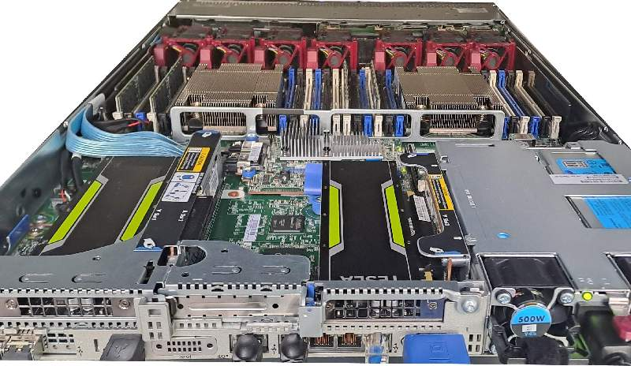
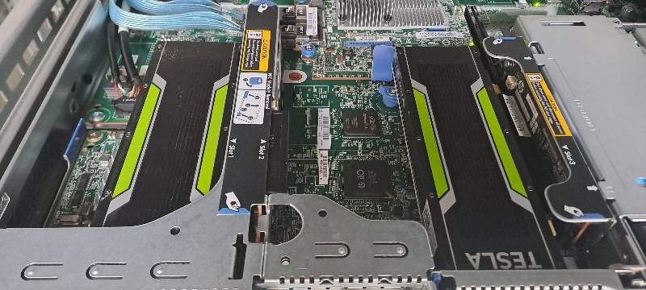
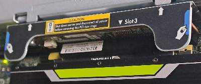
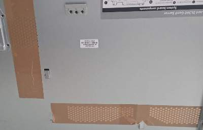
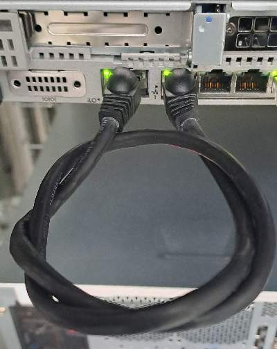

# A craft project: Building a small GPU server with a HP Proliant and passively cooled NVIDIA Tesla cards like M4, P4, A2 or T4 



## Abstract
You can run passively cooled single slot Tesla GPU cards in a HP Proliant with a modified iLO (integrated Lights-Out) ROM that take care of the fan and consequently temperature control. First you need to flash a new modified iLO ROM. Then the Linux script 'ilofancontrol' can control the fan speed by ssh remote commands on the iLO system. A systemd script 'ilofancontrol.service' checks and regulates the fan speed dynamically according to the CPU und GPU temperature.


**HP Proliant DL360 Gen9 with two NVIDIA Tesla M4 GPU cards**


## Introduction
NVIDIA Tesla M4, P4 or T4 GPU cards do not have an active cooling system and were designed for special GPU servers that have special fans and cooling channels to direct the airflow through the GPU cards. This is a proof of concept that a HP Proliant server can run a passively cooled GPU card. The test set consists of a HP DL360 Gen9 machine and two NVIDIA Tesla M4 cards.


## Material and methods
### Hardware
You need the following hardware:
- Working **HP Proliant DL360 Gen9** or similar server. Maybe an old one from the out-of-service stack :-)
- One or two **NVIDIA Tesla** M4, P4 or T4 (Check the available PCIe 3x16 slots)
- (for model DL360Gen9 you need a **2nd riser card** to add a second NVIDIA Tesla - e.g. for 775420-001 / 764642-B21 ) 
- **A short LAN wire** 
- Some **duct tape** 


**HP Proliant Riser card**


**Covered holes with duct tape**

You need to cover the holes in the server cover with duct tape. This forces the airflow to take the way through the GPU cards. Remove all PCIs slot brackets. Insert one or more GPU cards. 

You can use one of the network interfaces to link to the iLO network interface.


**iLO connection**


### [> First flashing the new iLO 'fan ROM'](flashing_ilo/readme.md)

### Then getting started:

Configurate two of the network interfaces: One for LAN connection and one for a private network with iLO interface (e.g. 192.168.1.2 if iLO interface has  192.168.1.3). See  /etc/cloud/cloud.cfg.d/90-installer-network.cfg


Connect the LAN wire with the iLO and normal LAN interfaces.
****


### Software
**Install:**
- **Bare metal Linux e.g. Ubuntu 24 LTS**
- [> Install NVIDIA Linux driver](nvidia_driver_installation/readme.md)
- **sshpass** - Non-interactive ssh password authentication (apt-get install sshpass)

**Install further recommended Linux packages**

- **NVIDIA**
- > **GPUstat** - pretty nvidia device monitor
- > **nvtop** - Interactive NVIDIA GPU process monitor
- > **nvidia-opencl-dev** - NVIDIA OpenCL development files
- > **nvidia-cuda-dev** - NVIDIA CUDA development files
- > **nvidia-cuda-toolkit-gcc** - NVIDIA CUDA development toolkit (GCC compatibility)

- **Sensor programs**
- > **freeipmi-tools** - GNU implementation of the IPMI protocol - tools (apt-cache search ipmi-sensors)
- > **lm-sensors** - utilities to read temperature/voltage/fan sensors
- > **htop** - interactive processes viewer

- **Other**
- > **net-tools** - NET-3 networking toolkit

- **Stress programms**
- > **stress** - tool to impose load on and stress test a computer system
- > **GPU-burn** - Multi-GPU CUDA stress test from https://github.com/wilicc/GPU-burn

- **Additional benchmark programs**
- > OpenCL-Benchmark (https://github.com/ProjectPhysX/OpenCL-Benchmark)
- > Geekbench 5 from https://www.geekbench.com/download/ (wget https://cdn.geekbench.com/Geekbench-5.4.1-Linux.tar.gz; tar xf Geekbench-5.4.1-Linux.tar.gz; cd Geekbench-5.4.1-Linux; ./geekbench5 or ./geekbench5  --gpu )


### Fan control scripts: ilofancontrol & ilofancontrol.service
The script ilofancontrol is placed to /usr/local/bin/ilofancontrol/ilofancontrol and controlled by ilofancontrol.service (/lib/systemd/system/ilofancontrol.service). Before enabling the service you can test it by calling on command line ./ilofancontrol test The program will loop and output sensor values. 

**Installation:**
```
it ! test -e /usr/local/bin/ilofancontrol/ then; mkdir /usr/local/bin/ilofancontrol/; fi

cp  show_fans.sh  /usr/local/bin/ilofancontrol/show_fans.sh
cp  ilofancontrol /usr/local/bin/ilofancontrol/ilofancontrol
cp  ilofancontrol.service /usr/local/bin/ilofancontrol/ilofancontrol.service

chmod 755 /usr/local/bin/ilofancontrol/show_fans.sh
chmod 755 /usr/local/bin/ilofancontrol/ilofancontrol
chmod 755 /usr/local/bin/ilofancontrol/ilofancontrol.service

ln -s  /usr/local/bin/ilofancontrol/ilofancontrol.service /lib/systemd/system/ilofancontrol.service

systemctl daemon-reload
systemctl enable ilofancontrol.service
systemctl start ilofancontrol.service
systemctl status ilofancontrol.service
```


#### iLo fan command:
The fan control is done by this lines: "fan p $I min $FAN" This means: Set "fan p [0..6] min [0..254]" with a value of 0 is 0% fan speed and a value of 254 is 100% fan speed.
```
for I in $ALLFANS
do
    sshpass -p "$PASSWORD" ssh -oKexAlgorithms=+diffie-hellman-group14-sha1,diffie-hellman-group1-sha1 -oHostKeyAlgorithms=ssh-rsa,ssh-dss $USERNAME@$ILOIP "fan p $I min $FAN" > /dev/null

done
```

## Results
Running the programs stress (CPU stress program) and GPU_burn (GPU stress programm) in parallel prevents the temperature of CPU and GPU from exceeding the well of 60C (140F). All fans spin up to max. 51%. 

```
./GPU_burn -d   360
Using compare file: compare.ptx
Burning for 360 seconds.
GPU 0: Tesla M4 (UUID: GPU-57ddd9f4-21d7-fb14-1730-04d714cae275)
GPU 1: Tesla M4 (UUID: GPU-583efd6c-e754-0c6a-45c6-03ad4cac8ed8)
Initialized device 0 with 3778 MB of memory (3726 MB available, using 3353 MB of it), using DOUBLES
Results are 536870912 bytes each, thus performing 4 iterations
Initialized device 1 with 3778 MB of memory (3726 MB available, using 3353 MB of it), using DOUBLES
Results are 536870912 bytes each, thus performing 4 iterations
 19.2%  proc'd:  4 (64 Gflop/s) -  0 ( 0 Gflop/s)   errors: 0 - 0   temps: 52 C - 52 C
 29.4%  proc'd:  4 (64 Gflop/s) -  4 (64 Gflop/s)   errors: 0 - 0   temps: 53 C - 54 C
 40.6%  proc'd:  8 (65 Gflop/s) -  8 (65 Gflop/s)   errors: 0 - 0   temps: 54 C - 54 C
 51.7%  proc'd:  8 (65 Gflop/s) -  8 (65 Gflop/s)   errors: 0 - 0   temps: 54 C - 54 C
 62.8%  proc'd: 12 (65 Gflop/s) - 12 (65 Gflop/s)   errors: 0 - 0   temps: 53 C - 54 C
 73.9%  proc'd: 12 (65 Gflop/s) - 12 (65 Gflop/s)   errors: 0 - 0   temps: 53 C - 54 C
 85.0%  proc'd: 16 (65 Gflop/s) - 16 (65 Gflop/s)   errors: 0 - 0   temps: 53 C - 54 C
 96.1%  proc'd: 20 (65 Gflop/s) - 20 (65 Gflop/s)   errors: 0 - 0   temps: 53 C - 54 C
100.0%  proc'd: 20 (65 Gflop/s) - 20 (65 Gflop/s)   errors: 0 - 0   temps: 53 C - 54 C
done
Tested 2 GPUs:
        GPU 0: OK
        GPU 1: OK
```
```
sensors
coretemp-isa-0001
Adapter: ISA adapter
Package id 1:  +60.0°C  (high = +90.0°C, crit = +100.0°C)
Core 0:        +58.0°C  (high = +90.0°C, crit = +100.0°C)
Core 1:        +60.0°C  (high = +90.0°C, crit = +100.0°C)
Core 2:        +59.0°C  (high = +90.0°C, crit = +100.0°C)
Core 3:        +57.0°C  (high = +90.0°C, crit = +100.0°C)
```
```
./nvidia-smi
+-----------------------------------------------------------------------------------------+
| NVIDIA-SMI 550.90.07              Driver Version: 550.90.07      CUDA Version: 12.4     |
|-----------------------------------------+------------------------+----------------------+
| GPU  Name                 Persistence-M | Bus-Id          Disp.A | Volatile Uncorr. ECC |
| Fan  Temp   Perf          Pwr:Usage/Cap |           Memory-Usage | GPU-Util  Compute M. |
|                                         |                        |               MIG M. |
|=========================================+========================+======================|
|   0  Tesla M4                       Off |   00000000:08:00.0 Off |                    0 |
| N/A   53C    P0             40W /   75W |    3124MiB /   3840MiB |    100%      Default |
|                                         |                        |                  N/A |
+-----------------------------------------+------------------------+----------------------+
|   1  Tesla M4                       Off |   00000000:82:00.0 Off |                    0 |
| N/A   53C    P0             40W /   75W |    3124MiB /   3840MiB |    100%      Default |
|                                         |                        |                  N/A |
+-----------------------------------------+------------------------+----------------------+
+-----------------------------------------------------------------------------------------+
| Processes:                                                                              |
|  GPU   GI   CI        PID   Type   Process name                              GPU Memory |
|        ID   ID                                                               Usage      |
|=========================================================================================|
|    0   N/A  N/A   1175591      C   ./GPU_burn                                   3120MiB |
|    1   N/A  N/A   1175602      C   ./GPU_burn                                   3120MiB |
+-----------------------------------------------------------------------------------------+
```


```
OpenCl-Benchmark:
.-----------------------------------------------------------------------------.
|----------------.------------------------------------------------------------|
| Device ID    0 | Tesla M4                                                   |
| Device ID    1 | Tesla M4                                                   |
|----------------'------------------------------------------------------------|
|----------------.------------------------------------------------------------|
| Device ID      | 0                                                          |
| Device Name    | Tesla M4                                                   |
| Device Vendor  | NVIDIA Corporation                                         |
| Device Driver  | 550.90.07 (Linux)                                          |
| OpenCL Version | OpenCL C 1.2                                               |
| Compute Units  | 8 at 1074 MHz (1024 cores, 2.200 TFLOPs/s)                 |
| Memory, Cache  | 3778 MB, 384 KB global / 48 KB local                       |
| Buffer Limits  | 944 MB global, 64 KB constant                              |
|----------------'------------------------------------------------------------|
| Info: OpenCL C code successfully compiled.                                  |
| FP64  compute                                         0.068 TFLOPs/s (1/32) |
| FP32  compute                                         2.048 TFLOPs/s ( 1x ) |
| FP16  compute                                          not supported        |
| INT64 compute                                         0.453  TIOPs/s (1/4 ) |
| INT32 compute                                         0.697  TIOPs/s (1/3 ) |
| INT16 compute                                         2.094  TIOPs/s ( 1x ) |
| INT8  compute                                         2.098  TIOPs/s ( 1x ) |
| Memory Bandwidth ( coalesced read      )                         68.54 GB/s |
| Memory Bandwidth ( coalesced      write)                         66.63 GB/s |
| Memory Bandwidth (misaligned read      )                         31.04 GB/s |
| Memory Bandwidth (misaligned      write)                         17.47 GB/s |
| PCIe   Bandwidth (send                 )                          6.38 GB/s |
| PCIe   Bandwidth (   receive           )                         10.05 GB/s |
| PCIe   Bandwidth (        bidirectional)            (Gen4 x16)    6.39 GB/s |
|-----------------------------------------------------------------------------|
|----------------.------------------------------------------------------------|
| Device ID      | 1                                                          |
| Device Name    | Tesla M4                                                   |
| Device Vendor  | NVIDIA Corporation                                         |
| Device Driver  | 550.90.07 (Linux)                                          |
| OpenCL Version | OpenCL C 1.2                                               |
| Compute Units  | 8 at 1074 MHz (1024 cores, 2.200 TFLOPs/s)                 |
| Memory, Cache  | 3778 MB, 384 KB global / 48 KB local                       |
| Buffer Limits  | 944 MB global, 64 KB constant                              |
|----------------'------------------------------------------------------------|
| Info: OpenCL C code successfully compiled.                                  |
| FP64  compute                                         0.068 TFLOPs/s (1/32) |
| FP32  compute                                         2.045 TFLOPs/s ( 1x ) |
| FP16  compute                                          not supported        |
| INT64 compute                                         0.452  TIOPs/s (1/4 ) |
| INT32 compute                                         0.698  TIOPs/s (1/3 ) |
| INT16 compute                                         2.091  TIOPs/s ( 1x ) |
| INT8  compute                                         2.094  TIOPs/s ( 1x ) |
| Memory Bandwidth ( coalesced read      )                         68.53 GB/s |
| Memory Bandwidth ( coalesced      write)                         66.63 GB/s |
| Memory Bandwidth (misaligned read      )                         30.87 GB/s |
| Memory Bandwidth (misaligned      write)                         17.43 GB/s |
| PCIe   Bandwidth (send                 )                          7.62 GB/s |
| PCIe   Bandwidth (   receive           )                          7.21 GB/s |
| PCIe   Bandwidth (        bidirectional)            (Gen3 x16)    7.70 GB/s |
|-----------------------------------------------------------------------------|
|-----------------------------------------------------------------------------|
| Done. Press Enter to exit.                                                  |
'-----------------------------------------------------------------------------'

```

```
OpenCL Geekbench-5.4.1-Linux Benchmark

      System Information

System Information
Operating System        Ubuntu 24.04 LTS
Model                   HP ProLiant DL360 Gen9
Motherboard             N/A

CPU Information
Name                    Intel Xeon E5-2623 v3 
Topology                2 Processors, 8 Cores, 16 Threads
Base Frequency          3.50 GHz
L1 Instruction Cache     32.0 KB x 4
L1 Data Cache            32.0 KB x 4
L2 Cache                256.0 KB x 4
L3 Cache                 10.0 MB x 1

Memory Information
Memory                  62.76 GB

OpenCL Information
Platform Vendor         NVIDIA Corporation
Platform Name           NVIDIA CUDA
Device Vendor           NVIDIA Corporation
Device Name             Tesla M4
Compute Units           8
Maximum Frequency       1074 MHz
Device Memory           3.69 GB


      OpenCL Performance

OpenCL Score            17518
Sobel                   24119   6.24 Gpixels/sec
 
Canny                   13675  856.0 Mpixels/sec
Stereo Matching         38885   55.0 Gpixels/sec
Histogram Equalization  17508    3.0 Gpixels/sec
Gaussian Blur           10504  577.4 Mpixels/sec
Depth of Field          50167  581.6 Mpixels/sec
Face Detection           6620   51.0 images/sec
Horizon Detection       17879  440.7 Mpixels/sec
Feature Matching         4997  103.4 Mpixels/sec
Particle Physics        58251 1551.6 FPS
SFFT                    11693  161.1 Gflops

```

`


```
Fan control with ipmi-sensors
./show_fans.sh
58 | Fan 1 DutyCycle  | Fan                      | 51.74      | %     | 'OK'
61 | Fan 2 DutyCycle  | Fan                      | 51.74      | %     | 'OK'
64 | Fan 3 DutyCycle  | Fan                      | 51.74      | %     | 'OK'
67 | Fan 4 DutyCycle  | Fan                      | 51.74      | %     | 'OK'
70 | Fan 5 DutyCycle  | Fan                      | 51.74      | %     | 'OK'
73 | Fan 6 DutyCycle  | Fan                      | 51.74      | %     | 'OK'
76 | Fan 7 DutyCycle  | Fan                      | 51.74      | %     | 'OK'

```

## Discussion
This project is a craft project, but in all it opens a nice way to run NVIDIA single slot Tesla cards in a 1U rack server. The original focus of the iLO ROM patch was to spin down the fans in order to silence them. In this project it is used to increase the fan speed to cool the passive GPU cards. In 2024 you can buy refurbished Tesla M4 cards for about 60$ and P4 cards for 120$ in internet shops. Maybe this is a nice and cheap start for PhD oder master students to get an own GPU server for KI training. Thanks to all those who enabled this iLO ROM that can control fan settings. Without this iLO ROM extension this project would not have been successful. It is a pity that there is no direct control of fan speed on HP Proliant Gen9 machines from Linux like in the fancontrol project. (Gen10 server with iLO 5 or up maybe can interface fan control by API.)


## Sources
- https://github.com/kendallgoto/ilo4_unlock
- https://github.com/That-Guy-Jack/HP-iLO-Fan-Control
- https://www.reddit.com/r/homelab/comments/sx3ldo/hp_ilo4_v277_unlocked_access_to_fan_controls/
- https://www.reddit.com/r/homelab/comments/hix44v/silence_of_the_fans_pt_2_hp_ilo_4_273_now_with/
- https://tkrn.io/u/tkrn/ilo4/
- https://www.reddit.com/user/phoenixdev/
- https://www.reddit.com/r/homelab/comments/n42cxv/silence_of_the_fans_pt_2_hp_ilo_4_273_now_with/
- https://www.reddit.com/r/homelab/comments/di3vrk/silence_of_the_fans_controlling_hp_server_fans/
- https://pingtool.org/latest-hp-ilo-firmwares/
- https://downloads.hpe.com/pub/softlib2/software1/sc-linux-fw-ilo/p192122427/v188589/CP046020.scexe

